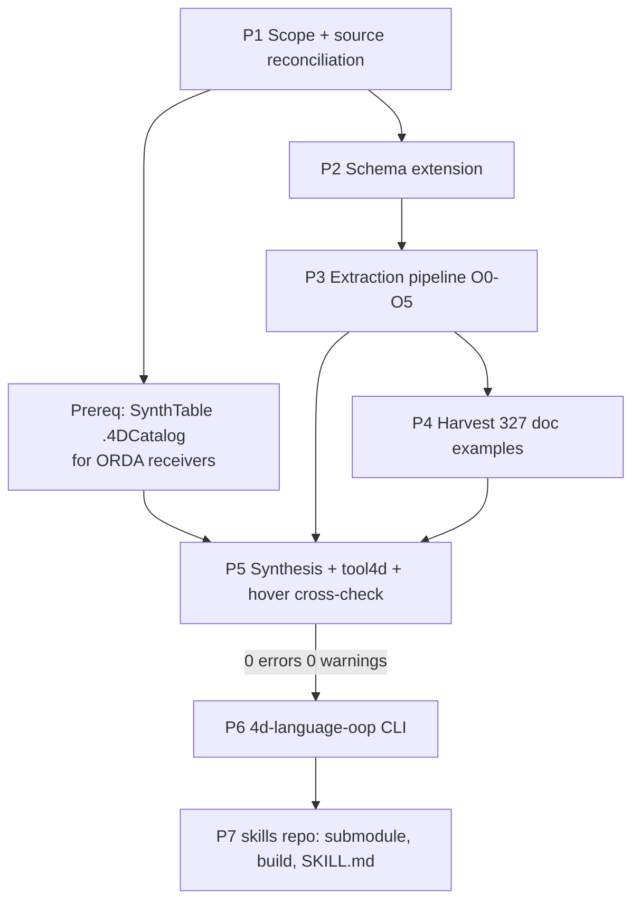

# Plan — 4D OOP language IR, synthetic examples, and `4d-language-oop` CLI

End-to-end plan mirroring the completed classic-language effort
(`pipeline/stage0..6`, `out/4d-command-ir.json`, `miyako/4d-language-classic`),
adapted to the OOP surface.

---

## 0. Ground truth established (already verified)

| Fact | Value | Consequence |
|---|---|---|
| `references/syntaxEN.json` OOP classes | 45 (+`4D` constructor namespace, +`_command_` = classic, ignored) | Primary structured spine |
| OOP functions in syntaxEN | 258 | |
| OOP properties in syntaxEN | 227 | **New IR concept** — classic had no properties |
| `4D.<X>.new()` constructors | 19 | Distinct `kind` |
| `mirror/docs/21-R3/API/*.html` pages | 45 | Prose/enrichment source |
| Member sections (`<h2>`) in API pages | 559 | **~55 more than syntaxEN** → reconciliation task |
| Hand-written `Example` sections in API pages | 327 | **Real examples exist** — big divergence from classic |
| IR schema `CommandEntry.kind` | already includes `oop_method` | Schema was pre-designed to unify |
| `TypeRef.concrete.name` | already documents `4D.<Class>` | Types unify already |

Two source-of-truth streams, same as classic (structured spine + prose
enrichment), but with the polarity flipped: for classic, HTML was the spine
and there were no examples; for OOP, `syntaxEN.json` is the typed spine, HTML
supplies prose/constraints/**and real examples**.

---

## Phase 1 — Scope decision & source reconciliation (no code yet)

**1.1 Decide the OOP surface.** Proposed in-scope / out-of-scope:

- **In scope**: the 45 built-in classes in `mirror/docs/21-R3/API/` and their
  members (functions, properties, constructors), plus the `4D.<X>.new()`
  class-store constructors, plus `cs.`/`4D.` class-store *access* semantics
  as documented protocol (not per-class entries).
- **Deferred/out of scope (log explicitly, mirroring Stage 0's
  `manifest.json.skipped[]` discipline)**:
  - `aikit/` (4D AIKit is a component, not base language — same reasoning that
    excluded `4D-View-Pro` from classic Stage 6; it also can't be provisioned
    in the throwaway check project).
  - ORDA *generated* classes (`cs.<DataClass>`, `cs.<DataClass>Entity`, …) —
    these are user-schema-dependent, not fixed signatures. Model them as a
    **template/protocol** in Layer 2, not as command entries.
  - `Concepts/` pages (`classes.html`, `shared.html`, function-declaration
    syntax, `Function`/`property` keywords, `#DECLARE`) — these are *language
    grammar*, not member signatures. Capture the subset needed to synthesize
    valid calls (Phase 5) as a Layer-2 sub-grammar; don't turn them into
    entries.
  - Pseudo-members like `.attributeName` on `Entity`/`DataClass` — real doc
    sections but not fixed names; model as `dynamicMember: true` entries with
    a name pattern.

**1.2 Reconcile the 559 vs 504 delta.** Write a throwaway diff script that
joins API-page `<h2>` member names against `syntaxEN.json` keys per class and
classifies each mismatch into: (a) syntaxEN missing a documented member,
(b) doc-only alias/overload heading, (c) deprecated/removed member, (d) name
normalization artifact (`.foo()` vs `foo()`, zero-width spaces, `<h2>` used
for non-members). Output `out/oop_source_diff.json`, human-reviewed **before**
extraction starts. This is the OOP equivalent of the classic scan's
category-hit review (`stage2_candidates.py`).

**1.3 Version pinning.** Reuse `pipeline/common/docsroot.py` — same
auto-selection of the highest non-BETA version folder (`21-R3` today), same
`--version` override. `syntaxEN.json` carries no version marker: record the
version it was captured against in the manifest and add a
`--syntax-json` path flag so a future capture is swappable.

**Deliverable**: `pipeline/oop/SCOPE.md` + `out/oop_source_diff.json`,
reviewed and signed off. No IR written yet.

---

## Phase 2 — Schema extension (`4d-command-ir-schema.json`)

The schema already anticipates OOP (`kind: "oop_method"`, `4D.<Class>` types)
but has no way to express a **receiver**, a **property**, or **class
membership**. Extend minimally and additively — the classic corpus must keep
validating unchanged.

**2.1 New/extended `CommandEntry` fields**
- `kind` enum += `oop_function`, `oop_property`, `oop_constructor`,
  `oop_class`. Keep the existing `oop_method` value as a deprecated alias to
  avoid breaking any consumer.
- `receiver` (object, required when kind is an OOP member):
  `{ classId, kind: "instance" | "class" | "namespace", typeRef }` —
  e.g. `Entity` instance vs `4D.File` class-store call vs `4D` namespace.
- `memberName` — the bare `.diff` / `.length` name, distinct from `id`.
- `accessor` (properties only): `{ readable, writable, computed }` plus
  `type` (a `TypeRef`). A property has no `overloads`; make `overloads`
  conditionally required (`if kind is oop_property then require accessor`).
- `nullable` on returns, `throwsErrors` (OOP throws where classic sets
  `OK`/`error` system vars) — capture as `errorModel`.

**2.2 New root-level `classes{}` (Layer 2 addition)**
Per-class metadata authored once and referenced by member entries:
`{ id, displayName, docPage, instantiation (how you get one), superclass,
isAbstract, isSingleton, sharedSemantics, members[] }`. This is where "how do
I even obtain a `4D.FileHandle`" lives — critical for example synthesis and
for agent lookup, and it has no classic analogue.

**2.3 Layer 3 relationship kinds** += `member_of`, `returns_instance_of`,
`obtained_via` (e.g. `File.open()` → `4D.FileHandle`), `classic_equivalent`
(e.g. `Folder` class vs `Get 4D folder`) — the last one is the payoff of a
unified IR: cross-linking OOP and classic entries in one graph.

**2.4 ID scheme.** `4D.Entity.diff`, `4D.File.new`, `Collection.length`.
Must not collide with classic ids (which are `SCREAMING-KEBAB` /
`Capitalized-words`). Add a schema-level uniqueness check across both corpora
if they are ever merged (see Phase 8 decision).

**Deliverable**: bumped schema + `references/4d-oop-ir-examples.json` (worked
examples for the worst cases below), validated with `boon`; the existing
`out/4d-command-ir.json` still validates against the bumped schema (regression
gate).

**Worst cases to stress-test the schema against, chosen deliberately:**
`Collection.query()` (embedded query sub-grammar → `subgrammar_ref`, already
exists), `Collection.orderBy()` (string DSL *or* collection of objects →
`equivalent_overloads`), `Entity.save()` / `.drop()` (`dk` enum + returned
status-object *structure*, which the schema currently can't describe → decide
whether to add `returnsShape`), `EntitySelection.query()` (placeholders +
formula), `File.open()` (handle-producing → reuse `handleTypes`),
`SystemWorker.new()` (callback contract object → reuse `callbackContracts`),
`WebServer` (41 members, mostly config properties), `Signal`/`Session`
(shared-object semantics), `Formula`/`Function.call()`/`.apply()` (pseudo-type
`Expression`), generic `Class.me` / `.superclass` (reflection).

---

## Phase 3 — Extraction pipeline (`pipeline/oop/`)

New sibling package to `pipeline/`, reusing `pipeline/common/*` (`cache.py`,
`docsroot.py`, `htmlutil.py`, `extract.py`) rather than forking them.

| Stage | Script | Input | Output |
|---|---|---|---|
| O0 | `stage0_manifest.py` | `syntaxEN.json` + `API/*.html` | `out/oop_manifest.json` (one row per class+member, content hash of *both* sources, skip log) |
| O1 | `stage1_extract.py` | manifest + HTML | `out/oop_stage1_raw.json` (per-member: syntax lines, param table, summary, description prose, examples, History table, See also) |
| O2 | `stage2_signatures.py` | `syntaxEN.json` | Deterministic parse of the `Syntax` markdown grammar → typed overloads |
| O3 | `stage3_merge.py` | O1 + O2 | Per-member IR JSON in `out/oop_stage3_ir_full/`, schema-validated individually |
| O4 | `stage4_classes.py` | O1 + O3 | Root `classes{}` layer + Layer-3 edges |
| O5 | `stage5_assemble.py` | all above + overlays | `out/4d-oop-ir.json` + `out/oop_diff_report.json` |

**Why O2 is deterministic and this is the big win.** The `Syntax` string has a
strict, machine-parsable grammar:

```
**.drop**( {*mode* : Integer} ) : Object
**4D.Blob.new**( *blobScal* : Blob ) : 4D.Blob
```

→ receiver, member name, ordered params with `name : Type`, `{}` optionality,
`;` separators, `<br/>`-separated overloads, `: ReturnType`. Write a real
tokenizer + recursive-descent parser for it (not regexes), with a
**round-trip test**: re-render the parsed AST back to the syntax string and
require byte-equality (modulo documented normalizations) for 100% of the 504
members. Any non-round-tripping member is a parser gap or a doc typo — triage
each one; don't paper over it. This gives near-zero-guess signatures, unlike
classic where HTML table parsing needed LLM assistance and heavy overlays.

**`Params` table cross-check.** Each member's `Params` array gives
`[name, type, direction, description]`. Validate the O2 AST against it:
every non-`Result` param must appear, types must agree, `Result` must match
the parsed return type. Mismatches → `out/oop_param_conflicts.json` for
review. Two independent sources agreeing is the accuracy floor.

**HTML enrichment (O1) supplies what syntaxEN cannot:**
- `Description` prose → `constraints`, `jointConstraints`, `interactionNotes`,
  error/throw behavior, thread-safety, server/remote caveats.
- Constant/enum mentions (`` `dk force drop if stamp changed` `` appears in
  the param description) → resolve against
  `references/4d-constants-registry.json` (already built) to emit `enum_ref`
  instead of bare `Integer`. **This is the single highest-value enrichment**:
  it turns dozens of `Integer` params into checkable enums.
- `History` tables → `sinceVersion`, `deprecated`, `versionBehaviorChanges`.
- `See also` → Layer-3 edges.
- Return-value object shapes described in prose → `returnsShape` (if adopted
  in 2.1).

**Overlay mechanism.** Reuse the classic pattern verbatim:
`pipeline/oop/semantic_overlays/<id>.json` hand-authored corrections merged at
O5, so machine extraction is never edited in place and re-runs are safe. Every
overlay carries a `_reason` field citing the doc page or the compiler
diagnostic that motivated it.

**Caching/idempotency**: identical to classic — sha1 per member over both
sources, `cache/oop/<id>.<hash>.json`, diff report at O5 so a docs refresh
only reprocesses changed members.

**Deliverable**: `out/4d-oop-ir.json`, schema-valid, ~504+ entries, with a
coverage report proving every in-scope member from Phase 1.2's reconciled list
is present or explicitly skipped with a reason.

---

## Phase 4 — Curated real examples (new, no classic analogue)

Before synthesizing anything, harvest the **327 hand-written `Example`
sections** from the API pages into `out/oop_doc_examples.json`, keyed by
member, with the surrounding prose caption. These are idiomatic,
human-authored, and vastly better agent-facing material than synthetic
placeholder code.

They are *not* trusted blindly: run every harvested snippet through the same
`tool4d check-syntax` harness as Phase 5. Expect a meaningful failure rate
(doc snippets are fragments — they reference undeclared `$vars`, `[Table]`s,
`cs.` user classes, and elided context). Triage into:

1. **compiles as-is** → mark `provenance: "documentation example, compiler-verified"`.
2. **compiles after mechanical wrapping** (auto-declare referenced locals,
   wrap in a method, stub `cs.` classes) → keep, mark
   `provenance: "documentation example, wrapped and compiler-verified"`,
   record the wrapper delta.
3. **cannot be made to compile without semantic invention** → keep as
   `provenance: "documentation example, not compiler-verified"`, never
   silently edited, and always paired with a synthetic example from Phase 5.

Result: most members get a *real* example, and synthesis is the fallback
rather than the only source — a strict quality upgrade over the classic CLI.

---

## Phase 5 — Synthetic example generation + `tool4d` cross-check

Port `pipeline/stage6_synth_examples.py`'s architecture (it is 88 KB of
hard-won knowledge) into `pipeline/oop/stage6_synth_examples.py`. Its sweep
design carries over directly; the *emission* layer is what changes.

**5.1 The receiver problem — the central new difficulty.** A classic call is
self-contained (`ALERT("x")`). Every OOP call needs a live receiver of the
right class first. So the synthesizer needs a **per-class instantiation
recipe table** (fed by `classes{}.instantiation` from Phase 2.2), e.g.:

```
Collection      -> $c:=New collection
File            -> $f:=File("/PACKAGE/x.txt")
FileHandle      -> $fh:=File("/PACKAGE/x.txt").open("write")
Entity          -> $e:=ds.SynthTable.new()      (needs a real datastore!)
EntitySelection -> $es:=ds.SynthTable.all()
Session         -> $s:=Session
WebServer       -> $ws:=WEB Server
Signal          -> $sig:=New signal
SystemWorker    -> $w:=4D.SystemWorker.new("echo")
```

Some receivers (ORDA ones) require the throwaway project to have a **real
structure**. Plan: add a minimal `.4DCatalog` (`SynthTable` with one field per
4D type) to the OOP check project — the `4dcatalog` skill in this repo already
covers authoring/validating that. This is a prerequisite task, not an
afterthought; it gates the whole ORDA class family (`DataStore`, `DataClass`,
`Entity`, `EntitySelection` — 88 members, ~18% of the corpus).

**5.2 Sweeps** (ported): default-all-params block per overload; enum-value
sweep over `enum_ref` params; optional-param present/omitted sweep (replaces
classic's `*`-flag sweep, which has no OOP analogue); union/overload
discriminator sweep. **New OOP-specific sweep**: property read vs. write for
`accessor.writable` properties.

**5.3 Typing is the payoff.** Because OOP is strictly typed, the generated
code should use **typed declarations** (`var $e : cs.SynthTableEntity`) rather
than classic's `Variant`-heavy placeholders. This makes `check-syntax`
dramatically stricter — the compiler will actually catch a wrong declared
return type, which it *cannot* do for classic's untyped calls. Expect this to
surface real IR bugs; that is the point.

**5.4 Harness.** Reuse `tool4d-lsp-stdio check-syntax` via the `4dlsp` skill
(project-wide single request, ~11 s for 2543 classic blocks — the OOP corpus is
smaller). New throwaway project `Project/4DOOPIRSynthCheck.4DProject`, files
`Project/Sources/Methods/SynthOOP_<id>.4dm`, artifacts
`out/oop_synth_manifest.json` + `out/oop_lsp_crosscheck_report.json`.

**5.5 The `hover` cross-check.** Per `skills/4dlsp/SKILL.md`, `check-syntax`
alone misses obsolete/renamed members. Run `tool4d-lsp-stdio hover` (or a
self-managed `mcp --project` server) over one call site per member to confirm
the compiler *knows* that member and reports a matching signature. Diff
hover's reported signature against the IR's — a third independent source, and
the strongest available correctness evidence. Record disagreements in
`out/oop_hover_crosscheck.json`.

**5.6 Convergence loop.** Target the same standard the classic corpus hit:
**0 errors, 0 warnings** across the whole generated corpus. Every diagnostic is
triaged to exactly one of: IR bug → fix via overlay + re-run O5; enum data bug
→ fix registry; synthesizer bug → fix emitter; genuine environment limitation
→ add to a documented, commented denylist with the empirical evidence, exactly
as `EXCLUDED_THEMES` / `FLAG_SWEEP_SKIP_EMPTY_CALL` are documented today.
Never silence a diagnostic without a written reason.

---

## Phase 6 — `miyako/4d-language-oop` CLI

New repo, deliberately a **sibling** of `4d-language-classic` with the same
Rust architecture, CLI surface, and response shape, so agents (and the skill
docs) learn one interface.

**6.1 Structure** (mirrors classic — `src/{cli,data,index,ir,lib,main,model,
server}.rs`, `build.rs` embedding data at compile time, zero runtime I/O):

```
data/vendor/4d-oop-ir.json
data/vendor/oop_doc_examples.json          # Phase 4 (new vs classic)
data/vendor/oop_synth_manifest.json
data/vendor/methods/SynthOOP_<id>.4dm
data/vendor/COMMIT                          # pinned 4d-static-docs commit
data/aliases.json
scripts/refresh-vendor.sh
```

**6.2 CLI surface** — classic's `query` / `serve` **plus** OOP-specific lookups
that the class model makes possible and that agents actually need:

```
4d-language-oop query "read a text file line by line" [--limit N] [--json]
4d-language-oop class 4D.File            # class card: members, how to obtain one
4d-language-oop member Collection.orderBy
4d-language-oop members --class Entity [--kind function|property]
4d-language-oop returns 4D.FileHandle    # what produces this class
4d-language-oop serve [--port 8080]      # GET /lookup, /class, /member, /health
```

**6.3 Ranking.** Reuse classic's deterministic tokenize → alias-expand →
`field_weight × IDF` → rank-with-id-tiebreak. Field weights need re-tuning for
OOP: class name and member name are *both* strong signals, and a query like
"file" should surface the `4D.File` class card, not 40 individual members.
Add a **class-level aggregation** rule so one class doesn't flood the top-N.

**6.4 Examples in the response.** Prefer the Phase-4 documentation example;
fall back to the Phase-5 synthetic one; always emit `provenance` and, for
synthetic output, the `placeholder_note` (classic's hard-won lesson — agents
copied placeholder tokens verbatim without it).

**6.5 Tests.** Port `tests/lookup_regression.rs`: a frozen set of ~40 natural
queries → expected top match, so ranking changes are always visible in a diff.

**6.6 Release.** GitHub Actions matrix build (macOS arm64/x64, Linux
arm64/x64, Windows x64), same artifact naming as classic, since `4dtools`
provisioning depends on that convention.

---

## Phase 7 — Skills integration (`miyako/skills`)

The skills repo already vendors `4d-language-classic` as a submodule, builds it
in `.github/workflows/release.yml`, and provisions it via `4dtools` into
`tools/4dlsp/` for the `4dlsp` skill to consume.

**7.1** Add `vendor/4d-language-oop` submodule (`.gitmodules`), pinned to a
tagged release.

**7.2** Add its build job to `release.yml`, matching the classic job's matrix
and artifact naming (`4d-language-oop-<os>-<arch>`).

**7.3** Update `4d-skills/skills/4dtools/SKILL.md`: add `4d-language-oop` to
the provisionable-tools table, the destination-dir table (`tools/4dlsp/`), the
verification snippets (macOS/Windows), and the "skill → tool → provisioner"
dependency diagram.

**7.4** New skill `4d-skills/skills/4dlang/SKILL.md` — or, better, decide
between two options:
- **(a) One `4dlang` skill** covering both classic and OOP lookup, routing to
  whichever binary fits the question. Best agent UX: an agent asking "how do I
  read a file in 4D" shouldn't have to know which language subset answers it.
  Requires the skill to teach the routing heuristic explicitly.
- **(b) Two skills** (`4dclassic`, `4doop`), simpler to write, but pushes the
  routing decision onto the agent and risks it only ever consulting one.

**Recommendation: (a)**, with the skill documenting "query both, prefer the
OOP answer for anything involving files, collections, ORDA, HTTP, email, or
workers; prefer classic for UI, printing, records, sets, and process control."
Also fold in the existing `4dlsp` mentions of `4d-language-classic` so there is
exactly one place describing language lookup.

**7.5** Update the root `4d-skills/AGENTS.md` skill-selection table with the
new row, and mirror all of it back into this repo's `AGENTS.md` + `skills/`
(the two copies must not drift — worth adding a CI check that diffs them).

**7.6** Bump `VERSION`, run the release workflow, verify end-to-end on a clean
machine: a fresh agent session provisions the tool via `4dtools` and answers an
OOP question from it.

---

## Phase 8 — Open decisions to settle before Phase 2

1. **One IR document or two?** `out/4d-oop-ir.json` separate vs. merging into
   `out/4d-command-ir.json`. *Recommendation: separate files, one shared
   schema, plus Layer-3 `classic_equivalent` edges in a third small
   `out/4d-ir-crosslinks.json`.* Keeps the classic artifact and its pinned
   consumers byte-stable, keeps CLI binaries independently sized, and still
   delivers the unified-graph benefit.
2. **`returnsShape`** — do we describe the *structure* of returned status
   objects (`.save()` → `{success, status, statusText}`)? Big agent value,
   moderate schema cost. *Recommendation: yes, as an optional field, extracted
   from prose with overlays; it's the OOP analogue of classic's enum work.*
3. **ORDA generated classes** — template-only (recommended) vs. attempting to
   model `cs.` classes generically.
4. **AIKit inclusion** — defer (component, unprovisionable), revisit if the
   check project can install it.
5. **Property examples** — synthesize read/write blocks for all 227 properties,
   or only for writable/non-trivial ones? *Recommendation: all, they're cheap.*

---

## Sequencing, gates, and effort



**Hard gates** (do not proceed past a red gate):
- G1: 100% syntax-string round-trip on all 504 members (end of P3/O2).
- G2: `out/4d-oop-ir.json` validates against the bumped schema **and** the
  existing classic IR still validates unchanged.
- G3: every in-scope member is present or explicitly skipped-with-reason.
- G4: 0 errors / 0 warnings across the full generated corpus, with every
  exclusion documented and evidenced.
- G5: `hover` signature agrees with IR signature for every member, or the
  disagreement is triaged and recorded.
- G6: CLI regression tests green; binary self-contained; provisioning verified
  on a clean machine.

**Rough effort**: P1 small; P2 medium; P3 large (the parser + enum resolution
are the bulk); P4 medium (triage-heavy); P5 large (receiver recipes + ORDA
project setup + convergence loop); P6 medium (architecture is a port); P7
small. The OOP corpus is ~⅓ the size of classic and far better typed, so P3
should be materially easier than its classic counterpart — the new cost is
concentrated in P5's receiver problem, which classic simply did not have.
